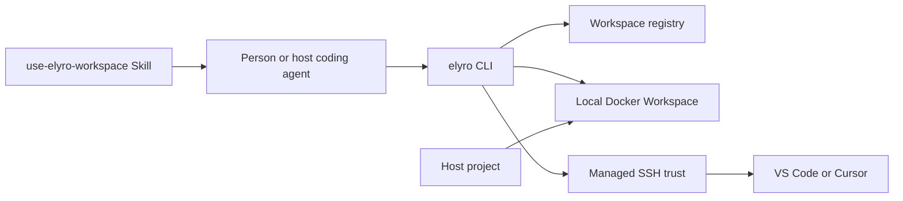

# Workspace Integration Topology

The host project path is the stable identity. `elyro exec` and `elyro shell` use Docker directly; SSH is not an execution dependency for automation. The Skill teaches a host coding agent to use the same public commands and never introduces a second lifecycle.

Changes crossing lifecycle, registry, JSON, image selection, SSH, or editor handoff start in `internal/workspace` and must update all affected command, smoke, and documentation contracts.
